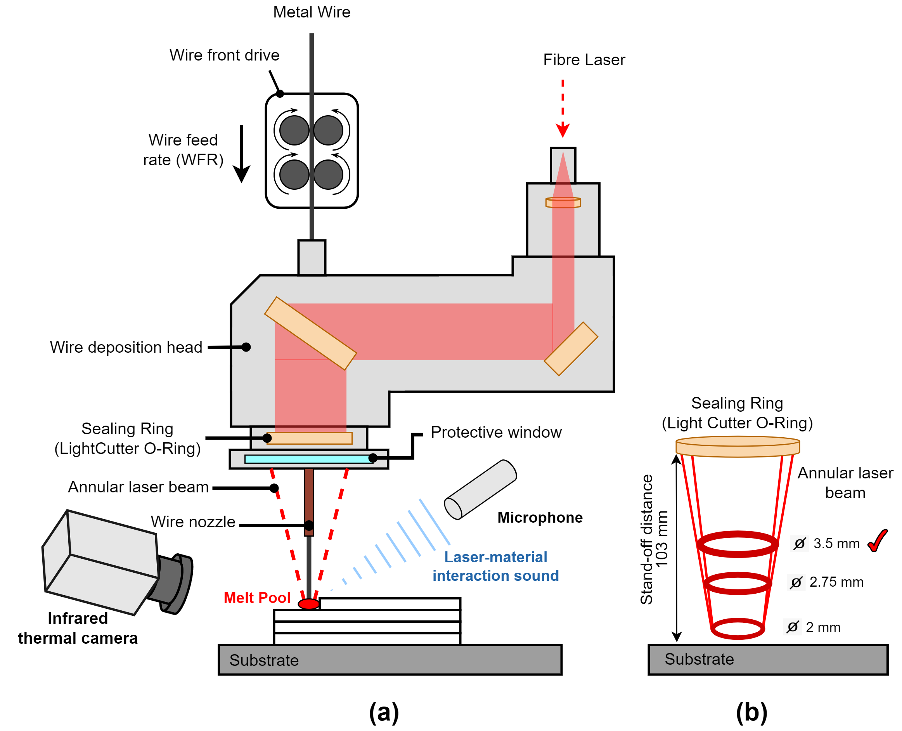
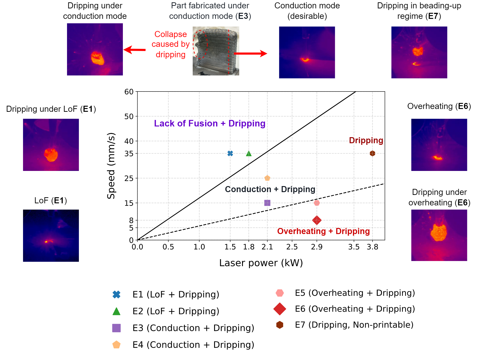
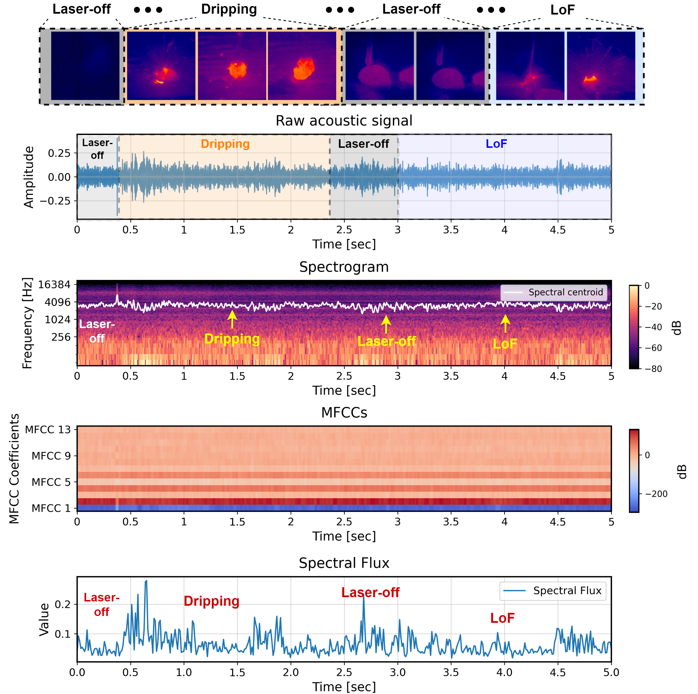

# MultiSensor-Monitoring-LW-DED

<div align="center">


</div>

> A comprehensive framework for thermal-acoustic monitoring of laser-wire directed energy deposition (LW-DED) process.

## 📋 Table of Contents

- [Overview](#-overview)
- [Research Highlights](#-research-highlights)
- [Installation](#-installation)
- [Usage](#-usage)
- [Video Demonstration](#-video-demonstration)
- [Visual Examples](#-visual-examples)
- [Publications](#-publications)
- [References](#-references)

## 📌 Overview

This repository provides a suite of tools for real-time monitoring and anomaly detection in Laser Wire-Directed Energy Deposition (LW-DED) processes. The system integrates thermal imaging and acoustic signal processing to enable in-situ quality monitoring during aluminum alloy (Al7075) deposition.

Key features include:
- Synchronized thermal and acoustic data acquisition (through Xiris Software)
- Real-time melt pool audio signal process and feature extraction
- Dripping anomaly detection using machine learning


## 💻 Installation

### Prerequisites
- Ubuntu 20.04
- Python 3.9+


### Basic Setup

1. Clone the repository:
   ```bash
   git clone https://github.com/Davidlequnchen/MultiSensor-Monitoring-LW-DED.git
   cd MultiSensor-Monitoring-LW-DED
   ```

2. Create a virtual environment (recommended):
   ```bash
   python -m venv venv
   source venv/bin/activate
   ```

3. Install the required packages:
   ```bash
   pip install -r requirements.txt
   ```

### Additional Dependencies

#### LightGBM Installation
For machine learning components using LightGBM:

```bash
# System dependencies
sudo apt-get install cmake build-essential libboost-dev libboost-system-dev libboost-filesystem-dev

# Python package
pip install lightgbm
```

For detailed LightGBM Python integration, see: [LightGBM Python Guide](https://blog.csdn.net/CSDNLHCC/article/details/135053162)


## 🎬 Video Demonstration

<table width="100%">
  <tr>
    <td align="center">
      <strong>Real-Time Melt Pool Monitoring in Wire-DED Process</strong><br>
      <a href="https://www.youtube.com/watch?v=XwlnRan0pqc">
        
        <br>
        
      </a>
    </td>
  </tr>
</table>

## 📊 Visual Examples

<table width="100%">
  <tr>
    <td align="center" width="50%">
      <strong>LW-DED Monitoring System</strong><br>
      
      <p><em>Schematic of coaxial wire-fed LW-DED system with integrated audio-thermal monitoring</em></p>
    </td>
    <td align="center" width="50%">
      <strong>Process Parameter Map</strong><br>
      
      <p><em>Process parameter map showing defect formation regimes in laser-wire deposition</em></p>
    </td>
  </tr>
</table>

<div align="center">
  
  <p><em>Characteristic audio-visual sensor signatures during LW-DED defect formation</em></p>
</div>

<!-- ## 📚 Publications

If you use this code in your research, please cite our work:

```
@article{YourName2023,
  title={Multi-Sensor Monitoring of Laser Wire-Directed Energy Deposition for Aluminum Alloys},
  author={Your Name and Co-authors},
  journal={Journal Name},
  year={2023},
  volume={},
  pages={}
}
``` -->

---

<div align="center">

**MultiSensor-Monitoring-LW-DED** © 2024

</div>
